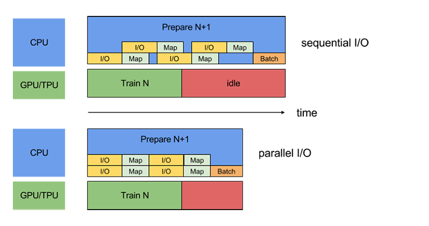

# Data Input Pipeline Performance

GPUs and TPUs can radically reduce the time required to execute a single training step. Achieving peak performance requires an efficient input pipeline that delivers data for the next step before the current step has finished.

## I. Input Pipeline Structure

A typical TensorFlow training input pipeline can be framed as an `ETL` process:

- **Extract**: Read data from persistent storage -- either local or remote
- **Transform**: Use CPU cores to parse and perform preprocessing operations on the data
- **Load**: Load the transformed data onto the GPUs or TPUs

When using the `tf.estimator.Estimator` API, the first two phases (**Extract** and **Transform**) are captured in the `input_fn` passed to `tf.estimator.Estimator.train`. In code, this might look like the following (naive, sequential) implementation:

```python
def parse_fn(example):
    "Parse TFExample records and perform simple data augmentation."
    features = {
        "image": tf.FixedLengthFeature((), tf.string, ""),
        "label": tf.FixedLengthFeature((), tf.int64, -1)
    }
    parsed = tf.parse_single_example(example, features)
    image = tf.image.decode_image(parsed["image"])
    image = _augment_helper(image)  # Data Augmentation
    return image, parsed["label"]

def input_fn():
    files = tf.data.Dataset.list_files("/path/to/dataset/train-*.tfrecord")
    dataset = files.interleave(tf.data.TFRecordDataset)
    dataset = dataset.shuffle(buffer_size=FLAGS.shuffle_buffer_size)
    dataset = dataset.map(map_func=parse_fn)
    dataset = dataset.batch(batch_size=FLAGS.batch_size)
    return dataset
```

## II. Optimizing Performance

GPUs and TPUs make it possible to train neural networks at an increasingly fast rate, the CPU processing is prone to becoming the bottleneck.

The `tf.data` API provides users with building blocks to design input pipelines that effectively utilize the CPU, optimizing each step of the ETL process.

### 1. Pipelining

**Pipelining** overlaps the preprocessing and model execution of a training step.

While the accelerator is performing training step `N`, the CPU is preparing the data for step `N+1`. Doing so reduces the step time to the maximum training and the time it takes to extract and transform the data.

Without pipelining, the CPU and the GPU/TPU sit idle much of the time:


With pipelining, idle time diminishes significantly:


The `tf.data` API provides a software pipelining mechanism through the `tf.data.Dataset.prefetch` transformation, which can be used to decouple the time data is produced from the time it is consumed.

```python
dataset = dataset.batch(batch_size=FLAGS.batch_size)
dataset = dataset.prefetch(buffer_size=FLAGS.prefetch_buffer_size)
return dataset
```

### 2. Parallelize Data Transformation

When preparing a batch, input elements may need to be pre-processed.

To this end, the `tf.data` API offers the `tf.data.Dataset.map` transformation, which applies a user-defined function (for example, `parse_fn` from the running example) to each element of the input dataset.

Because input elements are independent of one another, the pre-processing can be parallelized across multiple CPU cores.

To make this possible, the map transformation provides the `num_parallel_calls` argument to specify the level of parallelism.


**Note**:

- `num_parallel_calls` depends on hardware, characteristics of training data (such as size and shape), the cost of the map function, and what other processing is happening on the CPU at the same time.
- a simple heuristic is to use the number of available CPU cores

Furthermore, if batch size is in the hundreds or thousands, the pipeline will likely additionally benefit from parallelizing the batch creation.

```python
dataset = dataset.map(map_func=parse_fn,
                      num_parasllel_calls=FLAGS.num_parallel_calls)
dataset = dataset.batch(batch_size=FLAGS.batch_size)
```

### 3. Parallelize Data Extraction

The input data may be stored remotely (for example, GCS or HDFS), either because the input data would not fit locally or because the training is distributed and it would not make sense to replicate the input data on every machine.

A dataset pipeline that works well when reading data locally might become bottlenecked on I/O when reading data remotely because of the following differences between local and remote storage:

- **Time-to-first-byte**: Reading the first byte of a file from remote storage can take orders of magnitude longer than from local storage.
- **Read throughput**: While remote storage typically offers large aggregate bandwidth, reading a single file might only be able to utilize a small fraction of this bandwidth.

To mitigate the impact of the various data extraction overheads, the `tf.data` API offers the `tf.contrib.data.parallel_interleave` transformation.

Use this transformation to parallelize the execution of and interleave the contents of other datasets (such as data file readers).

The number of datasets to overlap can be specified by the `cycle_length` argument.

The following diagram illustrates the effect of supplying `cycle_length=2` to the `parallel_interleave` transformation:



```python
dataset = files.apply(tf.contrib.data.parallel_interleave(
    tf.data.TFRecordDataset, cycle_length=FLAGS.num_parallel_readers))
```

## III. Summary of Best Practices

- Add `prefetch(n)` (n is the number of elements / batches consumed by a training step) to the end of the input pipeline
- Parallelize the `map` transformation by setting the `num_parallel_calls`
- If you are working with data stored remotely and / or requiring deserialization, we recommend using the `parallel_interleave` transformation to overlap the reading (and deserialization) of data from different files
- If the data can fit into memory, use the `cache` transformation to cache it in memory during the first epoch, so that subsequent epochs can avoid the overhead associated with reading, parsing, and transforming it
- I recommend applying the `shuffle` transformation before the `repeat` transformation, ideally using the fused `shuffle_and_repeat` transformation

Example code:

```python
def input_fn(batch_size):
    filenames = tf.data.Dataset.list_files(FLAGS.data_dir)

    dataset = filenames.apply(tf.contrib.data.parallel_interleave(
        tf.data.TFRecordDataset, cycle_length=4, sloppy=True))

    # Use `tf.parse_single_example()` to extract data from a `tf.Example`
    # protocol buffer, and perform any additional per-record preprocessing.
    # In some cases, `head -n20 /path/to/tfrecords` bash commmand is used to
    # find out the feature names of a TFRecord
    def parser(record):
        features = {
            "image/encoded": tf.FixedLenFeature((), tf.string, default_value=""),
            "image/class/label": tf.FixedLenFeature((), tf.int64,
                                                    default_value=tf.zeros([], dtype=tf.int64)),
        }
        parsed = tf.parse_single_example(record, features)

        # Perform additional preprocessing on the parsed data.
        image = tf.decode_raw(parsed["image/encoded"], tf.float32)
        image = tf.reshape(image, [224, 224, 3])
        label = tf.cast(parsed["image/class/label"], tf.int32)

        return {"image": image}, label

    # Use `Dataset.map()` to build a pair of a feature dictionary and a label
    # tensor for each example.
    dataset = dataset.shuffle(buffer_size=10000)
    dataset = dataset.map(parser, num_parallel_calls=4)
    dataset = dataset.repeat(FLAGS.NUM_EPOCHS)
    dataset = dataset.batch(batch_size)
    dataset = dataset.prefetch(2)

    # Each element of `dataset` is tuple containing a dictionary of features
    # (in which each value is a batch of values for that feature), and a batch of
    # labels.
    return dataset
```